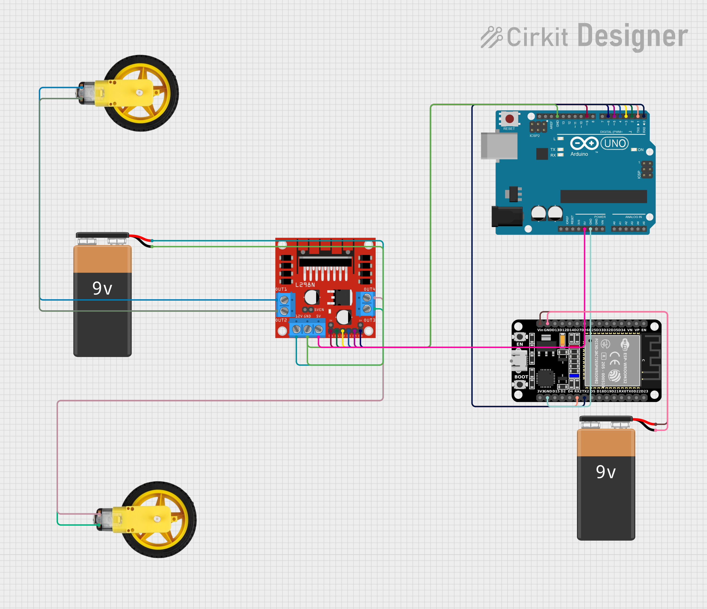
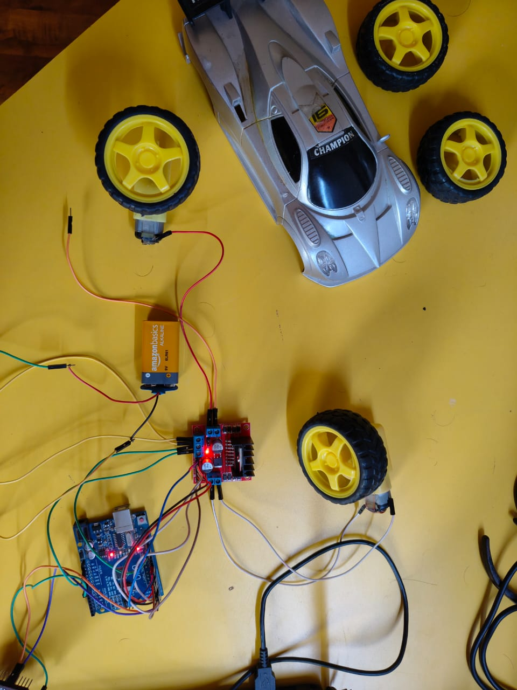

# web-controlled-robot-car
# 🚗 ESP32 + Arduino UNO Based RC Car

A DIY Wi-Fi Controlled RC Car built using an **ESP32**, **Arduino UNO**, **L298N Motor Driver**, and some DC gear motors. This project allows you to control your car wirelessly from any device over the same Wi-Fi network 🌐.

Made by [Nekunj](https://github.com/nekunj44) ✨

---

## 🔧 Features

- 📱 Web-based remote control (forward, backward, left, right, stop)
- 🌐 ESP32 Wi-Fi web server interface
- 🔁 Communication between ESP32 and Arduino UNO via UART
- 🔌 Dual power source: separate 9V batteries for ESP32 and motors
- ⚙️ L298N for motor driving and direction control

---

## 🖼️ Circuit Diagram

Here's the complete circuit diagram built using Cirkit Designer:

---

## 📸 Real Hardware Setup

Here’s the actual working setup of the project:

---

## ⚙️ Components Used

| Component         | Quantity |
|-------------------|----------|
| ESP32 Dev Board   | 1        |
| Arduino UNO       | 1        |
| L298N Motor Driver| 1        |
| DC Gear Motors    | 2        |
| 9V Batteries      | 2        |
| Jumper Wires      | bunch    |
| RC Car Chassis    | 1        |

---

## 📡 Wiring Overview

### ESP32 ⬌ Arduino UNO (UART Communication)

| ESP32 Pin     | Arduino UNO Pin |
|---------------|-----------------|
| GPIO 17 (TX2) | RX (Pin 0)      |
| GPIO 16 (RX2) | TX (Pin 1)      |
| GND           | GND             |

> ✅ Make sure Arduino is powered either via USB or its own 9V supply when communicating with ESP32.

### Motor Driver to Arduino

| L298N Pin | Arduino Pin |
|-----------|-------------|
| IN1       | 2           |
| IN2       | 3           |
| IN3       | 4           |
| IN4       | 5           |
| ENA       | 9           |
| ENB       | 6           |

### Powering

- Motor Driver: 9V Battery (to `+12V` and `GND` of L298N)
- ESP32: Separate 9V Battery through **Vin** and **GND**
- Don't power ESP32 using 3.3V pin – always use **Vin**!

---

## 🧠 How it Works

1. ESP32 hosts a web server with a control panel.
2. When a button is clicked, a command is sent to the ESP32 via HTTP.
3. ESP32 forwards the command (`F`, `B`, `L`, `R`, `S`) to Arduino UNO over UART.
4. Arduino interprets the character and controls motors via L298N accordingly.

---

## 🌐 Accessing the Car Controls

- Connect your phone/laptop to the **same Wi-Fi network** as the ESP32.
- Open the IP address shown on ESP32 Serial Monitor.
- Use the control buttons to drive!

---

## 💡 Improvements You Can Try

- Add speed sliders (PWM control from web)
- Use joystick-style control UI
- Add ultrasonic sensors for obstacle avoidance
- Add camera module for FPV streaming

---

## 🙋‍♂️ Author

Made with ❤️ by [Nekunj](https://github.com/nekunj44)

---

## 📄 License

This project is open-source and available under the [MIT License](LICENSE).

